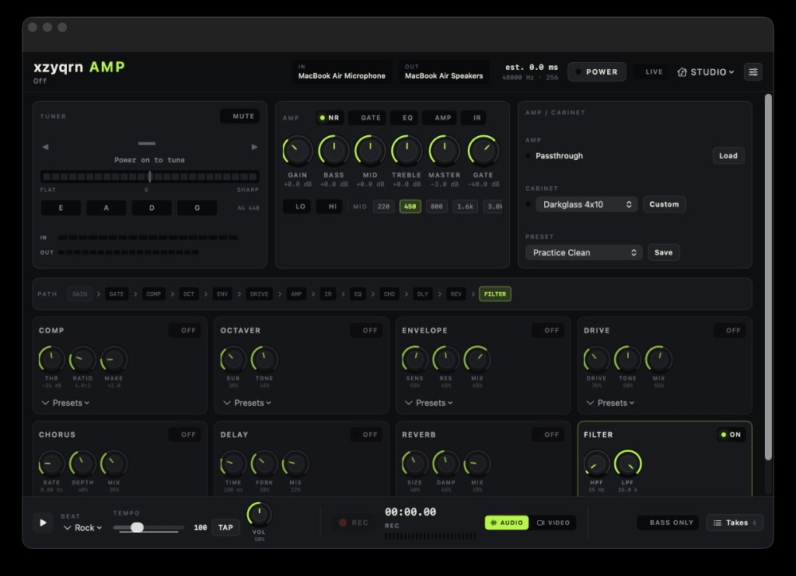

<div align="center">

# xzyqrn amp

### A complete bass rig, built for macOS.

Native amp modeling, effects, practice tools, and recording in one focused workspace.

Created by **xzyqrn**.

[](#requirements)
[](#under-the-hood)
[](https://github.com/sdatkinson/NeuralAmpModelerCore)
[](LICENSE)

[Features](#everything-needed-to-play) · [Quick start](#quick-start) · [Signal path](#signal-path) · [Development](#development)

</div>



**xzyqrn amp** turns a Mac and an audio interface into a native bass practice and recording setup. Shape a live input through Neural Amp Modeler captures, cabinet impulse responses, and a full pedalboard—then play along with grooves or capture the result without leaving the app.

## Everything needed to play

| | |
| --- | --- |
| **Amp & cabinet** | Load `.nam` captures, choose one of four bass cabinet IRs, and save complete rigs as presets. |
| **Pedalboard** | Noise gate, compressor, octaver, envelope filter, drive, EQ, chorus, delay, reverb, and utility filters. |
| **Practice tools** | Chromatic tuner, 12 groove styles, tap tempo, a tempo ladder, session notes, and practice history. |
| **Recording** | Record the processed bass, the complete post-master mix, or a video take with amp audio. |
| **Learning** | Read a user-owned Bass Method library and keep licensed web or local tab files beside the rig. |

The app has two working modes:

- **Live** is the low-friction playing surface: tuner, amp, cabinet, effects, grooves, and transport.
- **Studio** opens companion workspaces for **Practice Lab**, **Bass Method**, and **Bass Tabs**.

## Quick start

### Requirements

- A Mac running macOS 14 Sonoma or newer
- Xcode with the macOS SDK and command-line tools
- A bass and an audio interface or other available input
- Headphones or speakers connected to the selected output

### Build and run

Open `Amplifier.xcodeproj` in Xcode and run the **XzyqrnAmp** scheme, or build from Terminal:

```bash
xcodebuild \
  -project Amplifier.xcodeproj \
  -scheme XzyqrnAmp \
  -configuration Debug \
  -derivedDataPath build

open "build/Build/Products/Debug/xzyqrn amp.app"
```

No paid Apple Developer account is required for a local build.

### First sound

1. Connect the bass to the Mac through an audio interface.
2. Allow microphone access when macOS asks.
3. Open **xzyqrn amp → Settings** and select the input and output devices.
4. Click **POWER**, then raise the input gain until the meter shows a healthy signal without clipping.
5. Start with a factory rig or load a compatible `.nam` capture. Keep the cabinet enabled for amp-only captures.

> [!TIP]
> The audio buffer defaults to 128 samples. Try 64 for lower latency; use 256 if playback clicks or drops out.

## Studio workspaces

### Practice Lab

Keeps the live rig alongside the tuner, groove player, tempo ladder, recorder, lesson shortcuts, notes, and session history.

### Bass Method

Reads a user-owned *Hal Leonard Bass Method Complete Edition* folder in place. It pairs the book PDF with audio exercises, backing-only playback, notes, completion marks, and saved reading position. No book content is included in this repository.

### Bass Tabs

Keeps licensed web providers, saved links, favorites, and local tabs in one library. Local plain text, MusicXML, and Guitar Pro 3–8 files are supported; provider content stays with its provider.

## Signal path

```text
Bass
  → Input gain → Noise reduction → Gate → Compressor
  → Octaver → Envelope → Drive
  → NAM amp → Cabinet IR → EQ
  → Chorus → Delay → Reverb → HPF / LPF
  → Master → Output
```

The groove player joins the signal after the amp chain. Recording can tap either the bass alone or the full post-master mix.

## Factory content

- **18 complete rigs**, from clean practice tones to driven and bi-amped sounds
- **29 pedal presets** across dynamics, modulation, drive, ambience, and filtering
- **4 bass cabinet IRs**: 1×15, 2×12, 4×10, and 8×10
- **12 groove styles** between 40–240 BPM: Rock, Funk, Hip-Hop, Latin, Blues, Soul, Reggae, Disco, Metal, Jazz, Pop, and Electronic
- A clean starting model plus two attributed community NAM captures

## Under the hood

The interface and audio session are written in **Swift** and **SwiftUI**. The real-time DSP chain is implemented in **C++20** using **Core Audio**, **AudioUnit**, **AVFoundation**, and **Accelerate**, with [NeuralAmpModelerCore](https://github.com/sdatkinson/NeuralAmpModelerCore) embedded for capture playback.

```text
App/UI          SwiftUI views and controls
App/Audio       Audio session, devices, presets, beats, and recording
App/DSP         Real-time C++ effects and amp processing
App/Lessons     Practice, method-book, and tab libraries
App/Resources   Factory models, IRs, grooves, presets, and alphaTab
Tests           DSP, NAM, preset, and resource regressions
```

## Development

Run the DSP, NAM, preset, and bundled-resource regressions:

```bash
Scripts/test_audio.sh
```

Regenerate the cabinet IR, groove loops, and application icon:

```bash
python3 Scripts/bootstrap.py
```

## Credits and license

Created and maintained by **xzyqrn**.

xzyqrn amp is released under the [MIT License](LICENSE). It builds on:

- [Neural Amp Modeler](https://github.com/sdatkinson/NeuralAmpModelerCore) by Steven Atkinson — MIT
- [Eigen](https://eigen.tuxfamily.org) — MPL-2.0
- [nlohmann/json](https://github.com/nlohmann/json) — MIT
- [alphaTab](https://www.alphatab.net) and Bravura — MPL-2.0 and SIL Open Font License

Bundled community captures retain their authors' licenses and attribution. See [NOTICE.md](NOTICE.md) for details. Externally loaded captures remain the property of their creators.
